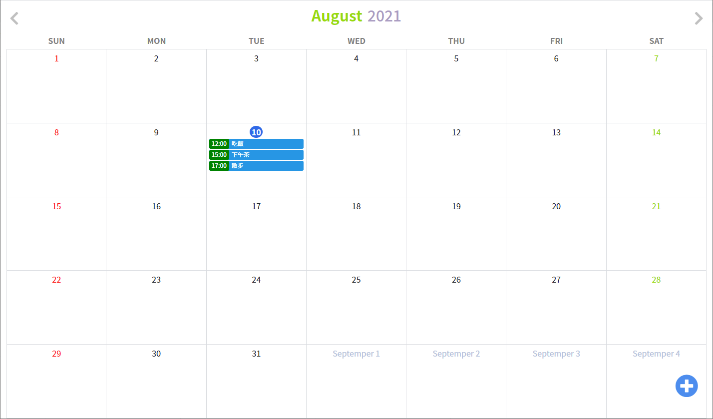
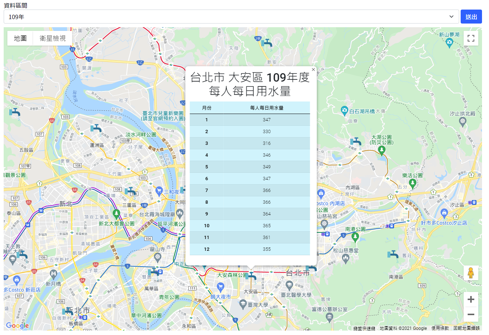

JFMio07.github.io
===
行事曆 [#Link](https://jfmio07.github.io/JSTAHW03/calendar.html)
===
### 利用JavaScript動態產生日期，配合DOM物件的操作並使用LocalStorage儲存資料，達到代辦事項的功能(新增 / 修改 / 刪除)

---
台灣各區域用水量 [#Link](https://jfmio07.github.io/JSTAHW02/waterusage)
===
### 使用AJAX取得各區域的經緯度、用水量資料，並配合JSON資料的處理，最後再使用Google Map API，將資料標記在各區域的地點當中

---
Toyota官網復刻 [#Link](https://jfmio07.github.io/CSSHW03/faketoyota)
===
### 練習運用HTML、CSS熟悉前端版面的排版

---

BuildSchool官網復刻 [#Link](https://jfmio07.github.io/CSSHW05/buildschool)
===
### 練習運用Bootstrap進行排版，完成前端版面並加上RWD的效果

---
